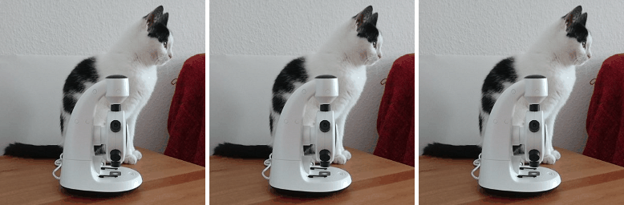

# Looping vision language model and image generation model

This repository contains [a notebook](looping_vision_and_image_generation.ipynb) that runs a vision model (GPT-4omni) and an image generation model (DALL-E 3) in a loop. The image description from the vision model is passed to the image generation model to create a new image. When running this in a loop with a given image showing a cat and a microscope, the content of the resulting stream of images seems to converge into a royal library place.

It was executed three times ([1](data_run1/looping_vision_and_image_generation.ipynb), [2](data_run2/looping_vision_and_image_generation.ipynb), [3](data_run2/looping_vision_and_image_generation.ipynb)) to [assemble a video](assemble_video.ipynb):



## Installation

```
pip install openai==1.30.1 scikit-image
```

